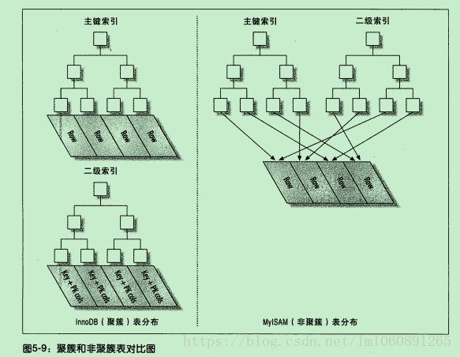

## 简介
**索引**是帮助MySQL高效获取数据的**排好序**的**数据结构**, 索引存储在文件里。
## 入门篇
磁盘寻道和旋转
### 索引结构
https://www.cs.usfca.edu/~galles/visualization/Algorithms.html
二叉树 ==> 红黑树 ==> btree ==> b+tree
hash
### 聚簇与非聚簇表


## FAQ
### MySQL为什么用自增主键
1. 省空间(非叶子节点能够存更多条)
2. 数字比较比字符串比较快
3. 如果碰到不规则数据插入时，为了保持B+树的平衡，会造成频繁的页分裂和页旋转，插入速度比较慢。所以聚簇索引的主键值应尽量是连续增长的值，而不是随机值(不要用随机字符串或UUID)。

### 分析一下几条sql的索引使用情况
| Table | Non_unique | Key_name | Seq_in_index | Column_name | Collation | Cardinality | Null | Index_type |
| --- | --- | --- | --- | --- | --- | --- | --- | --- |
| titles | 0 | PRIMARY | 1 | emp_no | A | NULL | | BTREE |
| titles | 0 | PRIMARY | 2 | title | A | NULL | | BTREE |
| titles | 0 | PRIMARY | 3 | from_date | A | 443308 | | BTREE |

```sql
SELECT * 
    FROM titles 
    WHERE emp_no = '1001' AND title = 'Senior Engineer' AND from_date = '1986-06-26';

SELECT * 
    FROM titles 
    WHERE title = 'Senior Engineer';

SELECT * 
    FROM titles 
    WHERE emp_no > '1001';

SELECT * 
    FROM titles 
    WHERE emp_no > '1001' ORDER BY title;
```